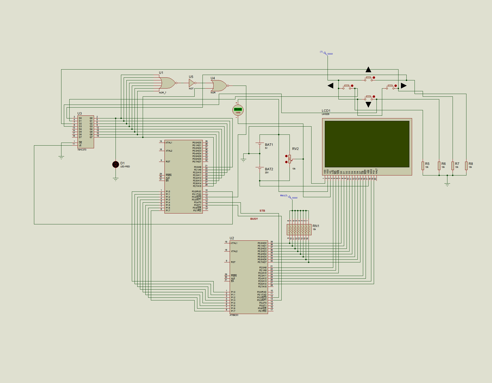

# OS_8051

Small multi-game firmware project for an 8051-based system with a separate display controller. The master AT89C51 reads the button input and sends drawing/text commands to a slave AT89C51, which drives an LM3229/T6963C LCD.



## Features

- Master/slave 8051 architecture.
- Parallel command bus with `STB`/`BUSY` handshake.
- LM3229/T6963C LCD graphics and text support.
- Double-buffered graphics pages.
- Four small demos/games:
  - Maze Runner
  - Rogue-like Dungeon
  - Conway's Game of Life
  - Retro Virtual Pet
- Proteus circuit file included: `circuit.dsn`.
- SDCC + CMake build system.

## Project Structure

- `src/` - master firmware logic.
- `include/` - master headers and controller helpers.
- `asm/` - master assembly entry/bridge code.
- `slave/1/` - slave LCD/GPU firmware.
- `cmake/` - SDCC build helper.
- `datasheet_pdf/` - LCD/controller datasheets.
- `setup.md` - detailed build setup notes.

## Build

Requirements:

- `sdcc`
- `sdas8051`
- `sdld`
- `packihx`
- CMake 3.20+

Build everything:

```sh
cmake -S . -B build
cmake --build build
```

Output HEX files:

- `build/master/master.hex`
- `build/slave/1/slave1/slave1.hex`

Build single targets:

```sh
cmake --build build --target master
cmake --build build --target slave1
```

## Hardware Summary

- Master MCU: AT89C51.
- Slave MCU: AT89C51.
- LCD: LM3229 with T6963C-compatible controller.
- Input: 4 direction buttons.
- Latch: 74HC373 for button capture.
- Master-to-slave command bus uses port data plus `STB` and `BUSY` control lines.

## Controls

Main menu:

- `UP` - Maze Runner
- `LEFT` - Rogue-like Dungeon
- `DOWN` - Game of Life
- `RIGHT` - Virtual Pet

Game controls are shown on the LCD inside each mode.

## Limitations

- Built for simulation/prototype use; timing may need tuning on real hardware.
- Only one LCD slave is implemented under `slave/1/`.
- Input is limited to four direction buttons.
- No persistent storage, score saving, sound, or serial debugging.
- Game content is intentionally small because of 8051 RAM limits.
- The master and slave use a simple blocking handshake, so drawing commands are not asynchronous.
- LCD scanline/display updates are slow, so many RAM and drawing optimizations were needed.
- The project may still contain bugs because it is a prototype-level firmware/simulation project.
- Some paths in `CMakeLists.txt` are machine-specific and may need editing on another setup.
- The project currently targets SDCC small memory model.

## Memory Notes

See [mem optimization.md](mem%20optimization.md) for the main RAM-saving approaches used in the firmware.
